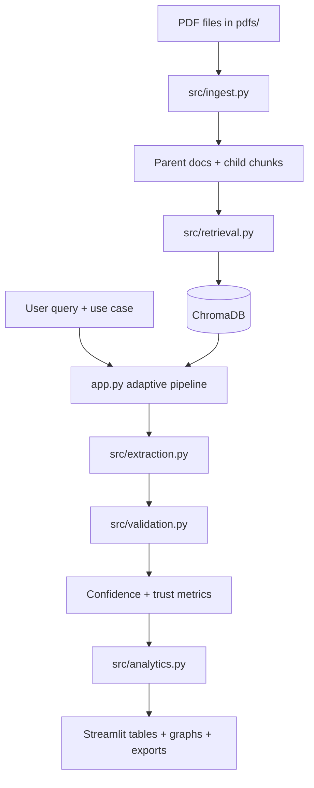

# 🏥 Sepsis Atlas

Sepsis Atlas is a Streamlit app that turns sepsis research PDFs into structured, source-grounded evidence tables. It indexes papers locally, retrieves relevant passages, and extracts schema-validated rows with traceable quotes so clinicians and researchers can review evidence quickly and consistently.

## Highlights

- Local-first indexing with ChromaDB (no server required)
- Layout-aware ingestion with optional table/image summaries
- Schema-driven extraction for three clinical tasks
- Quote verification and confidence scoring
- Contradiction cues and evidence graph views
- CSV/JSON/markdown exports for downstream analysis

## Use cases

| Use case | Goal | Primary output |
|---|---|---|
| UC1: Counterfactual mortality estimation | Identify predictor-outcome associations with effect sizes | Predictor/outcome rows with statistics |
| UC2: Sepsis phenotype extraction | Summarize clustering methods and phenotype descriptions | Study-level phenotype definitions |
| UC3: Biomarker risk stratification | Compare biomarkers and scores by predictive performance | Ranked biomarker/score evidence |

## Demo videos

This repository includes three short demo videos demonstrating the main use cases:

- [UC1: Counterfactual mortality estimation](docs/videos/uc1.mp4)
<video controls width="640" src="docs/videos/uc1.mp4">Your browser does not support the video tag.</video>

- [UC2: Phenotype extraction](docs/videos/uc2.mp4)
<video controls width="640" src="docs/videos/uc2.mp4">Your browser does not support the video tag.</video>

- [UC3: Biomarker ranking](docs/videos/uc3.mp4)
<video controls width="640" src="docs/videos/uc3.mp4">Your browser does not support the video tag.</video>


## Architecture at a glance



## Repository structure

| Path | Responsibility |
|---|---|
| `app.py` | Streamlit UI, adaptive retrieval loop, trust dashboard, exports |
| `config.py` | Environment-backed configuration |
| `src/ingest.py` | PDF parsing, visual summarization, section assembly, chunking |
| `src/retrieval.py` | ChromaDB indexing and enhanced retrieval |
| `src/extraction.py` | Prompting, parsing, normalization, schema-aware repair |
| `src/validation.py` | Quote verification and validation annotations |
| `src/analytics.py` | Contradiction graph and evidence knowledge graph |
| `src/schemas.py` | Pydantic schemas for UC1, UC2, and UC3 |
| `tests/test_pipeline.py` | Core local tests without API access |
| `tests/test_openrouter.py` | Manual API connectivity test; requires `OPENROUTER_API_KEY` |

## Quick start

### 1. Create an environment

```bash
git clone https://github.com/Adyansh04/sepsis-atlas.git
cd sepsis-atlas
python -m venv .venv
source .venv/bin/activate
```

### 2. Install dependencies

```bash
pip install -r requirements.txt
```

### 3. Configure environment variables

```bash
cp .env.example .env
```

Required values:

```dotenv
OPENROUTER_API_KEY=sk-or-...
DEFAULT_MODEL=anthropic/claude-3.5-sonnet
PDF_DIR=./pdfs
CHROMA_PERSIST_DIR=./chroma_db
```

### 4. Add papers

Place PDFs in `pdfs/`.

### 5. Start the app

```bash
streamlit run app.py
```

### 6. Index papers

Use the sidebar button **Index PDFs**. Re-index only when the corpus changes or the local vector store needs rebuilding.

## Query workflow

1. Select a use case.
2. Enter a clinical question.
3. The app expands the query and retrieves passages.
4. The adaptive pipeline retries with larger Top-K when quality is low.
5. The extractor returns structured rows.
6. Quotes are validated against retrieved chunks.
7. Missing required fields are repaired when possible.
8. Confidence, contradictions, and knowledge graph outputs are rendered.
9. Results can be exported as CSV, JSON, or markdown brief.

## Documentation

Core docs:

- [`docs/architecture.md`](docs/architecture.md) — high-level system architecture
- [`docs/data-flow.md`](docs/data-flow.md) — end-to-end indexing and query data flow

Developer reference:

- [`docs/module-reference.md`](docs/module-reference.md) — file-by-file responsibilities
- [`docs/ui-and-features.md`](docs/ui-and-features.md) — full UI and parameter reference
- [`docs/design-decisions.md`](docs/design-decisions.md) — design rationale and trade-offs
- [`docs/terminology-glossary.md`](docs/terminology-glossary.md) — definitions for key terms
- [`docs/troubleshooting.md`](docs/troubleshooting.md) — setup and runtime recovery steps

## Validation and tests

### Recommended core test command

```bash
python -m pytest tests/test_pipeline.py -v
```

### Important testing caveat

`tests/test_openrouter.py` is a manual API connectivity script that raises at import time if `OPENROUTER_API_KEY` is missing. Because of that, full `pytest tests/ -v` is not the best default local validation path unless you intentionally want to exercise the live API test.

## Common operational notes

- **No reindex needed after code-only changes**: reindex only when PDFs or Chroma contents change.
- **Missing OpenRouter key**: the app can still ingest locally, but LLM extraction and VLM summaries will not run.
- **Low-quality retrieval**: the adaptive pipeline will automatically retry with larger retrieval depth.
- **Missing fields**: the schema-aware repair pass targets only required missing fields instead of regenerating everything.

## Current limitations

- Live extraction quality still depends on model quality and source document quality.
- OCR/VLM enrichment is best-effort and can be noisy on visually complex pages.
- Contradiction detection uses heuristics, not full statistical reconciliation.
- The knowledge graph is intentionally offline and lightweight; it is for interpretation, not graph analytics at scale.

## License

MIT
