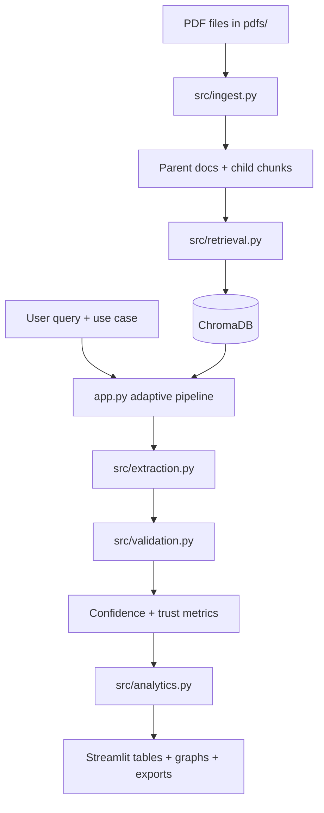
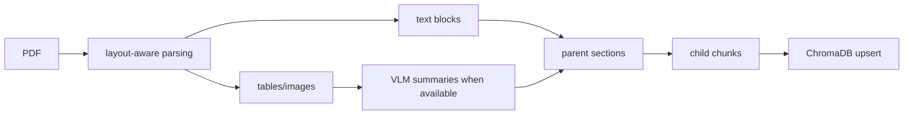
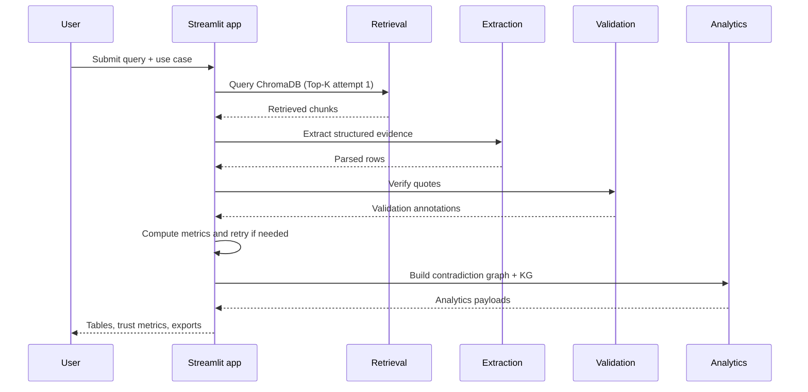

# 🏥 Sepsis Atlas

Sepsis Atlas is a Streamlit-based evidence extraction system for sepsis literature. It ingests PDFs, indexes section-aware chunks in ChromaDB, retrieves evidence for a clinical query, extracts schema-validated rows with an LLM, verifies quote provenance, and now adds agentic reliability layers such as adaptive retrieval retries, confidence scoring, contradiction detection, and an offline evidence knowledge graph.

## What the system does

- **Indexes** sepsis papers from `pdfs/`
- **Retrieves** relevant passages with semantic search and keyword fallback
- **Extracts** structured evidence for 3 hackathon use cases
- **Validates** extracted quotes against retrieved text
- **Repairs** missing required fields with schema-aware follow-up extraction
- **Scores** each row for confidence and completeness
- **Surfaces** contradictions and strongest evidence paths
- **Exports** CSV, JSON, and submission briefs

## Supported use cases

| Use case | Goal | Primary output |
|---|---|---|
| UC1 | Counterfactual mortality estimation | Predictor/outcome associations with effect sizes |
| UC2 | Sepsis phenotype extraction | Study-level phenotype definitions and cluster summaries |
| UC3 | Biomarker risk stratification | Biomarker/score comparison for mortality prediction |

## New reliability features

- **Adaptive retrieval retries** in `app.py` increase Top-K when early attempts have weak verification, poor schema coverage, or low confidence.
- **Schema-aware repair** in `src/extraction.py` identifies missing required fields and asks the model only for those missing values.
- **Contradiction graph builder** in `src/analytics.py` flags opposing effect directions or conflicting cutoffs across comparable evidence rows.
- **Offline evidence knowledge graph** in `src/analytics.py` converts extracted rows into typed entities and relations, including the strongest evidence path.
- **Trust dashboard** in `app.py` summarizes verified quotes, schema coverage, and average confidence.

## Documentation map

- [`docs/architecture.md`](docs/architecture.md) — high-level system architecture and runtime interactions
- [`docs/data-flow.md`](docs/data-flow.md) — detailed end-to-end indexing and query data flow
- [`docs/module-reference.md`](docs/module-reference.md) — what each repository file does
- [`docs/ui-and-features.md`](docs/ui-and-features.md) — every button, value, threshold, formula, and configuration parameter explained
- [`docs/design-decisions.md`](docs/design-decisions.md) — design rationale, feature decisions, and implemented fixes
- [`docs/troubleshooting.md`](docs/troubleshooting.md) — setup issues, runtime issues, testing caveats, and recovery steps

## Architecture at a glance



## Repository structure

| Path | Responsibility |
|---|---|
| `app.py` | Streamlit UI, adaptive retrieval loop, trust dashboard, exports |
| `config.py` | Environment-backed configuration |
| `src/ingest.py` | PDF parsing, visual summarization, section assembly, chunking |
| `src/retrieval.py` | ChromaDB indexing and enhanced retrieval |
| `src/extraction.py` | Prompting, parsing, normalization, schema-aware repair |
| `src/validation.py` | Quote verification and validation annotations |
| `src/analytics.py` | Contradiction graph and evidence knowledge graph |
| `src/schemas.py` | Pydantic schemas for UC1, UC2, and UC3 |
| `tests/test_pipeline.py` | Core local tests without API access |
| `tests/test_openrouter.py` | Manual API connectivity test; requires `OPENROUTER_API_KEY` |

## Quick start

### 1. Create an environment

```bash
git clone https://github.com/Adyansh04/sepsis-atlas-hackathon.git
cd sepsis-atlas-hackathon
python -m venv .venv
source .venv/bin/activate
```

### 2. Install dependencies

```bash
pip install -r requirements.txt
```

### 3. Configure environment variables

```bash
cp .env.example .env
```

Required values:

```dotenv
OPENROUTER_API_KEY=sk-or-...
DEFAULT_MODEL=anthropic/claude-3.5-sonnet
PDF_DIR=./pdfs
CHROMA_PERSIST_DIR=./chroma_db
```

### 4. Add papers

Place PDFs in `pdfs/`.

### 5. Start the app

```bash
streamlit run app.py
```

### 6. Index papers

Use the sidebar button **Index PDFs**. Re-index only when the corpus changes or the local vector store needs rebuilding.

## Query workflow

1. Select a use case.
2. Enter a clinical question.
3. The app expands the query and retrieves passages.
4. The adaptive pipeline retries with larger Top-K when quality is low.
5. The extractor returns structured rows.
6. Quotes are validated against retrieved chunks.
7. Missing required fields are repaired when possible.
8. Confidence, contradictions, and knowledge graph outputs are rendered.
9. Results can be exported as CSV, JSON, or markdown brief.

## Data-flow diagrams

### Indexing flow



### Query-time flow



## Validation and tests

### Recommended core test command

```bash
python -m pytest tests/test_pipeline.py -v
```

### Important testing caveat

`tests/test_openrouter.py` is a manual API connectivity script that raises at import time if `OPENROUTER_API_KEY` is missing. Because of that, full `pytest tests/ -v` is not the best default local validation path unless you intentionally want to exercise the live API test.

## Common operational notes

- **No reindex needed after code-only changes**: reindex only when PDFs or Chroma contents change.
- **Missing OpenRouter key**: the app can still ingest locally, but LLM extraction and VLM summaries will not run.
- **Low-quality retrieval**: the adaptive pipeline will automatically retry with larger retrieval depth.
- **Missing fields**: the schema-aware repair pass targets only required missing fields instead of regenerating everything.

## Troubleshooting summary

| Issue | Meaning | First action |
|---|---|---|
| `No documents indexed` | Chroma collection is empty | Add PDFs and click **Index PDFs** |
| `OPENROUTER_API_KEY not found` | Missing API key | Set key in `.env` or sidebar |
| Empty extraction result | Retrieval or prompt coverage is weak | Rephrase query and inspect retrieved passages |
| Low confidence / low verification | Weak quote support or sparse fields | Review retry metrics and source evidence |
| Need to continue locally | Documentation lives in `docs/` | Start with architecture and data-flow docs |

See [`docs/troubleshooting.md`](docs/troubleshooting.md) for the full guide.

## Current limitations

- Live extraction quality still depends on model quality and source document quality.
- OCR/VLM enrichment is best-effort and can be noisy on visually complex pages.
- Contradiction detection uses heuristics, not full statistical reconciliation.
- The knowledge graph is intentionally offline and lightweight; it is for interpretation, not graph analytics at scale.

## Next reading order

If you are onboarding a new contributor or another AI agent, read in this order:

1. `README.md`
2. `docs/architecture.md`
3. `docs/data-flow.md`
4. `docs/module-reference.md`
5. `docs/ui-and-features.md`
6. `docs/design-decisions.md`
7. `docs/troubleshooting.md`
