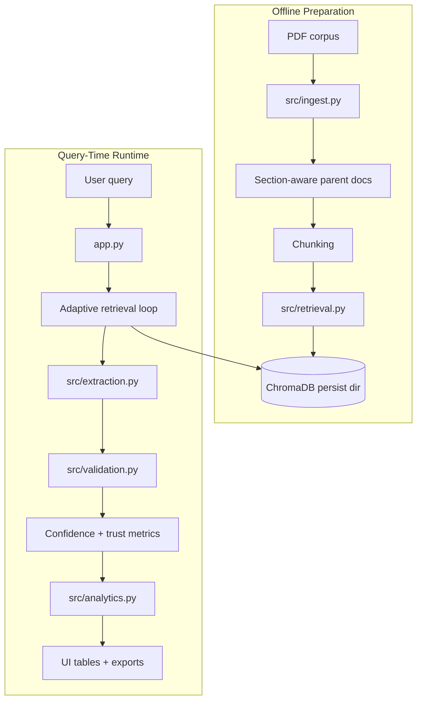
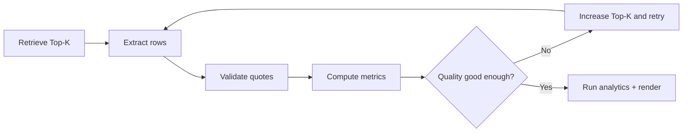

# Architecture

This document explains how Sepsis Atlas is assembled at a system level.

## 1. Core architecture

## 2. Runtime responsibilities

### `app.py`

`app.py` is the orchestrator. It owns:

- Streamlit UI state
- PDF indexing button behavior
- query expansion
- adaptive Top-K retrieval attempts
- extraction invocation
- validation enrichment
- confidence scoring
- trust dashboard rendering
- contradiction graph rendering
- knowledge graph rendering
- CSV / JSON / markdown export

### `src/ingest.py`

This module is the offline preparation layer. It:

- parses PDFs with layout-aware extraction
- captures tables and images where available
- optionally summarizes visuals through an OpenRouter VLM
- groups content into section-aware parent documents
- splits parent documents into child chunks for retrieval
- emits indexing progress reports

### `src/retrieval.py`

This module manages the local vector store:

- creates or opens a persistent ChromaDB collection
- upserts chunk text + metadata
- performs semantic search
- filters reference/bibliography-like chunks
- optionally augments semantic results with keyword fallback

### `src/extraction.py`

This module converts retrieved context into schema-constrained evidence rows:

- builds use-case-specific prompts
- sends the prompt to OpenRouter-compatible chat completion APIs
- parses JSON responses robustly
- normalizes inconsistent field shapes
- validates against Pydantic schemas
- repairs missing required fields without redoing entire rows

### `src/validation.py`

This module provides lightweight provenance checking:

- exact/substring quote verification
- high-overlap fallback verification
- validation status annotation (`verified`, `unverified`, `not_applicable`)

### `src/analytics.py`

This module adds interpretation layers after extraction:

- contradiction graph builder
- evidence knowledge graph builder
- strongest evidence path summary

## 3. Agentic reliability loop

The important architectural change is that the system is no longer a single-pass retrieval → extraction pipeline.

It now behaves as a small agentic workflow:

The retry decision is driven by:

- evidence count
- quote verification ratio
- schema coverage
- average confidence

## 4. Key model choices

| Component | Model | Purpose |
|---|---|---|
| Embedding | `BAAI/bge-large-en-v1.5` | Sentence-transformer for vector indexing and retrieval |
| Extraction LLM | User-selected (default `anthropic/claude-3.5-sonnet`) | Structured evidence extraction |
| VLM (visual) | `google/gemini-2.5-flash-image` | Table/image summarization during ingestion |

The embedding model runs locally via `sentence-transformers`. The LLM and VLM use the OpenRouter API.

## 5. Persistence boundaries

| Layer | Persisted? | Where |
|---|---|---|
| PDF corpus | Yes | `pdfs/` |
| Vector embeddings + metadata | Yes | `CHROMA_PERSIST_DIR` |
| Streamlit query state | Session-only | Streamlit session state |
| Extraction rows | No by default | export from UI if needed |
| Analytics graphs | No by default | derived at render time |

## 6. Why the architecture is split this way

The repository deliberately separates:

- **ingestion** from **retrieval**, so indexing can be reused across many queries
- **retrieval** from **extraction**, so retrieval quality can be improved independently
- **validation** from **extraction**, so provenance checks remain explicit
- **analytics** from **core pipeline**, so interpretation features do not complicate base extraction contracts

This separation makes the codebase easier to test and easier to extend with future use cases.

## 7. System outputs

At query time the UI returns more than one artifact:

1. primary evidence table
2. row-level source evidence
3. retry metrics table
4. trust dashboard
5. contradiction graph data
6. knowledge graph relations
7. CSV / JSON / markdown exports

That makes the app useful both as a demo and as a debugging tool.
