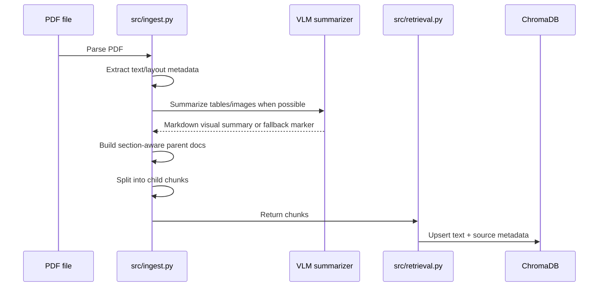
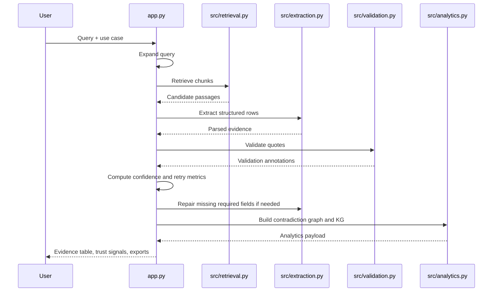

# Data Flow

This document explains exactly how data moves through the system.

## 1. Offline indexing flow

## 2. Query-time flow

## 3. Detailed step-by-step explanation

### Step A — PDF ingestion

Input:

- PDF files from `pdfs/`

Processing:

- layout-aware partitioning
- text block extraction
- image/table payload extraction where available
- optional VLM summarization for visual blocks
- parent document assembly by section/page
- child chunk creation for retrieval

Output chunk shape:

| Field | Meaning |
|---|---|
| `text` | retrievable chunk text |
| `source` | source document name |
| `page_number` | source page |
| `chunk_id` | unique chunk identifier |
| `section_name` | section label if known |
| `evidence_origin` | `raw_text`, `vlm_summary`, or `mixed` |
| `parent_id` | parent document grouping id |

### Step B — Retrieval

Input:

- expanded query
- use-case-specific keyword fallback list for UC2/UC3 when needed

Processing:

- semantic nearest-neighbor search in ChromaDB
- filtering of short/reference-like chunks
- optional merge with keyword hits

Output:

- ranked list of chunks for extraction

### Step C — Extraction

Input:

- user query
- retrieved chunks
- selected use case

Processing:

- prompt creation using use-case schema instructions
- chat completion call
- JSON parsing with fence/object fallback handling
- schema validation with Pydantic
- normalization of ambiguous field variants

Output:

- structured evidence rows

### Step D — Validation

Input:

- extracted rows
- retrieved chunks

Processing:

- verify whether `source.quote` appears in retrieved text
- assign validation status
- run cross-row consistency checks:
  - flag when same quote supports different predictors (potential copy-paste)
  - flag when same effect size from same study is assigned to different predictors (possible misattribution)

Output:

- evidence rows enriched with `_validation` and optionally `_consistency_warnings`

### Step E — Confidence and retries

Input:

- validated rows

Processing:

- compute per-row confidence from:
  - quote validation status
  - quote quality
  - field completeness
- compute attempt-level metrics:
  - evidence count
  - verified ratio
  - schema coverage
  - average confidence
- retry with larger Top-K if thresholds are weak

Output:

- final chosen evidence rows
- retry report for the UI

### Step F — Schema-aware repair

Input:

- partially complete evidence rows

Processing:

- find missing required fields per use case
- generate a patch-only repair prompt
- fill only missing fields
- keep already extracted fields stable

Output:

- repaired evidence rows with better required-field coverage

### Step G — Analytics

Input:

- final validated rows

Processing:

- group comparable evidence items
- detect contradictions
- build subject/outcome/population/study relations
- select strongest evidence path by confidence

Output:

- contradiction graph payload
- knowledge graph payload

## 4. UI-visible data products

After a successful run the user can inspect:

- retrieved passages
- adaptive retry metrics
- trust dashboard
- evidence table
- source-evidence expanders
- contradiction graph edges
- knowledge graph relations

## 5. Failure points in the flow

| Stage | Typical issue | Recovery already implemented |
|---|---|---|
| Ingestion | missing parser/VLM/API setup | fallback markers and progress reporting |
| Retrieval | weak first-pass recall | adaptive Top-K retries and keyword fallback |
| Extraction | malformed or incomplete JSON | parser recovery + schema validation |
| Validation | quote does not match retrieved text | explicit `unverified` status |
| Schema coverage | required fields blank | targeted schema-aware repair |
| Evidence coherence | conflicting studies | contradiction graph output |

## 6. Reindex guidance

Reindex when:

- new PDFs are added
- PDFs are changed
- the Chroma persistence directory is deleted or corrupted

Do **not** reindex for:

- prompt changes
- validation logic changes
- analytics/UI changes
- documentation-only changes
