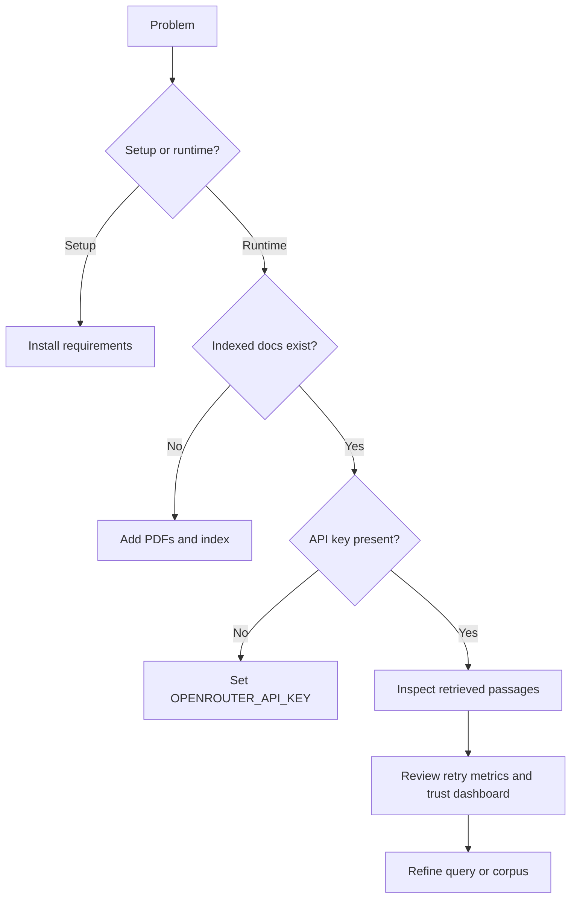

# Troubleshooting

This document collects the main setup, runtime, and validation issues you are likely to hit.

## 1. Local setup issues

### `No module named pytest`

Cause:

- the environment does not yet have test dependencies installed

Fix:

```bash
pip install -r requirements.txt
```

If you only need core validation quickly, install the missing packages and rerun:

```bash
python -m pytest tests/test_pipeline.py -v
```

### `No module named ...` for `pydantic`, `openai`, `dotenv`, or `langchain_text_splitters`

Cause:

- runtime dependencies are missing

Fix:

```bash
pip install -r requirements.txt
```

## 2. Testing caveats

### Why `pytest tests/ -v` may fail locally

`tests/test_openrouter.py` is not a normal isolated unit test. It raises immediately if `OPENROUTER_API_KEY` is not present in `.env`.

That means:

- **best core local validation:**  
  `python -m pytest tests/test_pipeline.py -v`
- **full test run only when you intentionally want the live API test:**  
  `pytest tests/ -v`

### Recommended validation order

1. install dependencies
2. run `python -m pytest tests/test_pipeline.py -v`
3. run the Streamlit app
4. only then run the live API script if needed

## 3. Runtime issues

### `OPENROUTER_API_KEY not found`

Cause:

- missing API key in `.env` or sidebar

Fix:

1. copy `.env.example` to `.env`
2. set `OPENROUTER_API_KEY`
3. restart the app if needed

### `No documents indexed`

Cause:

- the Chroma collection is empty

Fix:

1. add PDFs to `pdfs/`
2. click **Index PDFs**
3. wait for indexing to finish

### The app starts but extraction returns no rows

Possible causes:

- query is too broad
- retrieval found weak passages
- indexed corpus does not cover the query

What to do:

1. inspect retrieved passages in the UI
2. try a narrower query
3. verify that relevant PDFs are in the corpus
4. reindex only if the corpus changed

### Low verification or low confidence

Meaning:

- quotes are weakly grounded or fields are sparse

What to inspect:

- adaptive retrieval metrics
- source evidence expanders
- trust dashboard
- contradiction graph if studies disagree

## 4. Ingestion-specific issues

### OCR/VLM enrichment did not run

Possible causes:

- missing OpenRouter API key
- VLM model unavailable
- no usable image payload extracted

Behavior:

- ingestion should still proceed with fallback markers

### Visual extraction is noisy

Reality:

- tables and charts are harder than plain text

What to do:

- rely on source evidence review
- treat VLM summaries as supporting context, not perfect truth

## 5. Reindexing FAQ

### When should I reindex?

Reindex when:

- you add/remove PDFs
- you replace PDFs
- you delete/corrupt the Chroma persistence directory

### When should I not reindex?

Do **not** reindex after:

- README/docs edits
- UI-only edits
- extraction prompt tweaks alone
- validation logic changes alone
- analytics-only changes

## 6. Debugging checklist



## 7. Practical commands

Start app:

```bash
streamlit run app.py
```

Core tests:

```bash
python -m pytest tests/test_pipeline.py -v
```

Full tests including live API script:

```bash
pytest tests/ -v
```
